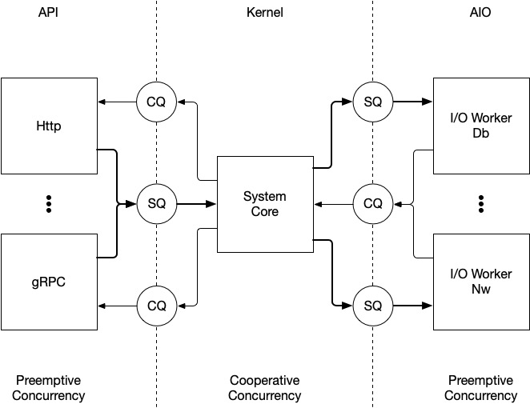

# Architecture

Resonate consists of three subsystems:

- Kernel
- API
- AIO

The Kernel implements cooperative concurrency via coroutines, API and AIO implement preemptive concurrency via goroutines. In other words, the Kernel is single threaded, API and AIO are multi threaded.

The API submits requests to the Kernel via the API Submission Queue, the Kernel submits responses to the API via per-request API Completion Queues. Conversly, the Kernel submits requests to the AIO via per-request-type Submission Queues, the AIO submits responses via the AIO Completion Queue.

## Submission & Completion Queues

The Kernel interacts with the API subsystem and the AIO subsystem via Submission and Completion Queues, implemented as buffered golang channels. A Submission Queue accepts Submission Queue Entries, a Completion Queue accepts Completion Queue Entries.

TBD

## Kernel

The Kernel is the control plane of Resonate while the API and the AIO are the data planes of Resonate. The Kernel consists of the Event Loop, the Scheduler and the Coroutine Abstraction.

### The Kernel's Event Loop

TBD

### The Coroutine Abstraction

TBD

